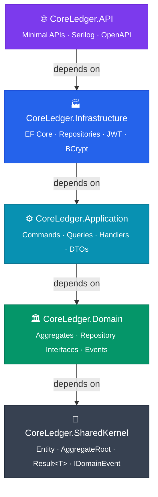

<p align="center">
  
</p>

<p align="center">
  
</p>

<p align="center">
  
  
  
  
  
</p>

<br/>

## 📖 About

**CoreLedger** is a modular banking platform built as a **learning project for C# and .NET**. It covers real-world backend engineering — from domain modeling and CQRS to JWT authentication and containerized integration tests.

The goal isn't to ship a product. The goal is to deeply understand how production-grade .NET systems are built.

**What this project practices:**

| Concept | Implementation |
|---|---|
| Clean Architecture | Strict inward dependency rule: `API → Infrastructure → Application → Domain → SharedKernel` |
| Domain-Driven Design | Aggregates (`User`, `Account`, `Transaction`, `LedgerEntry`) with rich domain behavior |
| CQRS | Every use case is a `Command` or `Query` handled by MediatR |
| Result Pattern | Handlers return `Result<T>` — no business exceptions thrown |
| Validation Pipeline | FluentValidation as MediatR behavior → automatic 400 responses |
| JWT + Refresh Tokens | Stateless auth with secure token rotation |
| EF Core + PostgreSQL | Code-first schema, Npgsql provider, migrations |
| Integration Testing | Real PostgreSQL via Testcontainers — no mocks for the database |

<br/>

## 🏗️ Architecture



<br/>

## ✨ Features

- 🔐 **JWT Authentication** — register, login, token refresh with rotation
- 🏦 **Account Management** — create, query, close accounts with balance tracking
- 💸 **Transfers** — idempotent transfers between accounts with duplicate protection
- 📒 **Double-Entry Ledger** — every transaction creates balanced `LedgerEntry` records
- 📄 **Pagination** — transactions endpoint with `page` + `pageSize` params
- 🛡️ **Validation Pipeline** — FluentValidation wired as MediatR behavior
- 🐳 **Docker Ready** — full stack via `docker compose up`
- 🧪 **Integration Tests** — Testcontainers spins up real PostgreSQL per test class

<br/>

## 🛠️ Tech Stack

### Backend

| Technology | Version | Purpose |
|---|---|---|
| .NET / ASP.NET Core | 10 | Runtime + Minimal APIs |
| MediatR | 14 | CQRS bus + pipeline behaviors |
| Entity Framework Core | 10 | ORM + migrations |
| Npgsql | latest | PostgreSQL EF provider |
| FluentValidation | 12 | Request validation |
| BCrypt.Net | 4 | Password hashing |
| JWT Bearer | 8 | Stateless authentication |
| Serilog | 10 | Structured logging |

### Frontend

| Technology | Version | Purpose |
|---|---|---|
| Next.js | 16 | React framework (App Router) |
| React | 19 | UI library |
| TanStack Query | 5 | Server state management |
| React Hook Form + Zod | 7 / 4 | Forms + schema validation |
| Radix UI + Tailwind CSS | — | Accessible components + styling |

### Testing & DevOps

| Technology | Purpose |
|---|---|
| NSubstitute | Unit test mocks (domain + handlers) |
| Testcontainers | Real PostgreSQL for integration tests |
| Docker + Compose | Container orchestration |
| Make | Task runner (`make dev`, `make test`) |

<br/>

## 🚀 Getting Started

### Option A — Docker (full stack)

```bash
# Clone
git clone https://github.com/bmesquita196/aprendendo-api.git
cd aprendendo-api

# Start everything
docker compose up --build
```

API available at `http://localhost:5000` · Frontend at `http://localhost:3000`

---

### Option B — Local development

**Prerequisites:** .NET 10 SDK, Docker (for PostgreSQL), Node.js 20+, pnpm

```bash
# 1. Start PostgreSQL
docker compose up postgres -d

# 2. Apply database migrations
dotnet ef database update \
  --project src/CoreLedger.Infrastructure \
  --startup-project src/CoreLedger.API

# 3. Run the API
dotnet run --project src/CoreLedger.API/CoreLedger.API.csproj

# 4. Run the frontend (separate terminal)
cd src/frontend
pnpm install && pnpm dev
```

Swagger UI: `http://localhost:5000/swagger`

**Default admin account (dev only):**
```
Email:    admin@coreledger.com
Password: Admin@123
```

<br/>

## 🔌 API Reference

<details>
<summary><strong>🔐 Auth</strong></summary>

| Method | Endpoint | Description | Auth |
|---|---|---|---|
| `POST` | `/auth/register` | Register new user | ❌ |
| `POST` | `/auth/login` | Login → returns JWT + refresh token | ❌ |
| `POST` | `/auth/refresh` | Rotate refresh token → new JWT | ❌ |

**Login response:**
```json
{
  "accessToken": "eyJ...",
  "refreshToken": "abc123...",
  "expiresIn": 3600
}
```

</details>

<details>
<summary><strong>🏦 Accounts</strong></summary>

| Method | Endpoint | Description | Auth |
|---|---|---|---|
| `POST` | `/accounts` | Create account | ✅ |
| `GET` | `/accounts/{id}` | Get account details | ✅ |
| `GET` | `/accounts/{id}/balance` | Get current balance | ✅ |
| `GET` | `/accounts/{id}/transactions` | List transactions (paginated) | ✅ |
| `DELETE` | `/accounts/{id}` | Close account | ✅ |

**Pagination params:** `?page=1&pageSize=20`

</details>

<details>
<summary><strong>💸 Transfers</strong></summary>

| Method | Endpoint | Description | Auth |
|---|---|---|---|
| `POST` | `/transfers` | Create transfer | ✅ |

**Request body:**
```json
{
  "sourceAccountId": "uuid",
  "destinationAccountId": "uuid",
  "amount": 100.00,
  "description": "Payment",
  "idempotencyKey": "unique-key-per-request"
}
```

> `idempotencyKey` prevents duplicate transfers — safe to retry on network failures.

</details>

<br/>

## 📁 Project Structure

```
aprendendo-api/
├── src/
│   ├── CoreLedger.SharedKernel/       # Entity, AggregateRoot, Result<T>, IDomainEvent
│   ├── CoreLedger.Domain/             # Aggregates + repository interfaces + domain events
│   ├── CoreLedger.Application/        # Commands, Queries, Handlers, DTOs, service interfaces
│   ├── CoreLedger.Infrastructure/     # EF Core, repositories, JWT, BCrypt implementations
│   ├── CoreLedger.API/                # Minimal API endpoints, Program.cs, middleware
│   └── frontend/                      # Next.js 16 app (App Router)
│
├── tests/
│   ├── CoreLedger.UnitTests/          # Domain logic + handler tests (NSubstitute, no DB)
│   └── CoreLedger.IntegrationTests/   # Endpoint tests (Testcontainers PostgreSQL)
│
├── docker-compose.yml
├── Dockerfile
├── Makefile
└── CoreLedger.slnx
```

<br/>

## 🧪 Testing

```bash
# Unit tests only (fast, no Docker needed)
dotnet test tests/CoreLedger.UnitTests/

# Integration tests (Docker required — Testcontainers auto-manages containers)
dotnet test tests/CoreLedger.IntegrationTests/

# All tests
dotnet test

# Single test by name
dotnet test --filter "FullyQualifiedName~CreateTransfer_ShouldDebitSource"
```

> Integration tests use **Testcontainers** to spin up a real PostgreSQL container per test class and tear it down automatically. No shared state, no mocks.

<br/>

## 📐 Design Principles

- **SRP** — each Handler has one reason to change; repositories do data access only
- **OCP** — new use case → new Command + Handler; existing handlers never modified
- **LSP** — all repository implementations fully substitutable (NSubstitute validates this)
- **ISP** — `IPasswordHasher`, `ITokenService`, `IUnitOfWork` are single-purpose interfaces
- **DIP** — Application depends on interfaces only; Infrastructure wires the implementations

> **Rule enforced:** `new ConcreteService()` outside DI registration is forbidden.

<br/>

<p align="center">
  
</p>

<p align="center">
  <sub>Built to learn C# · by <strong>Bruno Mesquita</strong></sub>
</p>
